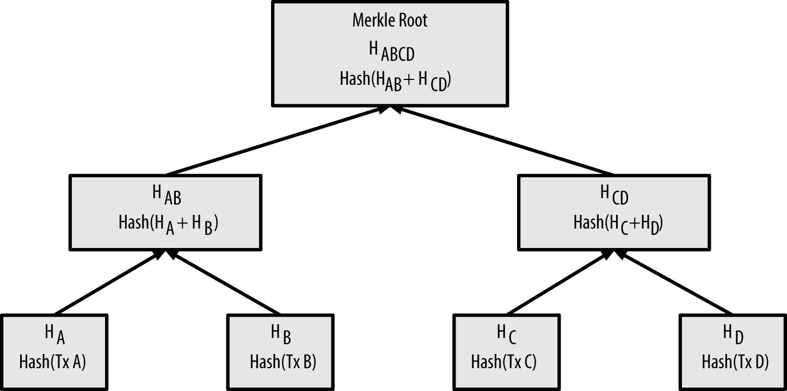

# Merkle Trees

* A merkle tree, also known as a binary hash tree, is a data structure used for efficiently summarizing and verifying the integrity of large sets of data
* When N data elements are hashed and summarized in a merkle tree, you can check to see if any one data element is included in the tree with at most 2*log~2~(N) calculations, making this a very efficient data structure.


## example

* The merkle tree is constructed bottom-up
* we start with four transactions, A, B, C, and D, which form the leaves of the merkle tree,
* The transactions are not stored in the merkle tree; rather, their data is hashed and the resulting hash is stored in each leaf node as HA, HB, HC, and HD
* Consecutive pairs of leaf nodes are then summarized in a parent node, by concatenating the two hashes and hashing them together
* The process continues until there is only one node at the top, the node known as the merkle root

```
HA = SHA256(SHA256(Transaction A))
...
.....
HAB = SHA256(SHA256(HA + HB))

```



* To prove that a specific transaction is included in a block, a node only needs to produce log~2~(N) 32-byte hashes, constituting an authentication path or merkle path connecting the specific transaction to the root of the tree
* This allows Bitcoin nodes to efficiently produce paths of 10 or 12 hashes (320–384 bytes), which can provide proof of a single transaction out of more than a thousand transactions in a megabyte-sized block

*  a node can download just the block headers (80 bytes per block) and still be able to identify a transaction’s inclusion in a block by retrieving a small merkle path from a full node, without storing or transmitting the vast majority of the blockchain


 
### node side test - merkleblock message

An SPV node that is interested in incoming payments to an address contained in its wallet. The SPV node will establish a bloom filter (see [bloom_filters]) on its connections to peers to limit the transactions received to only those containing addresses of interest. When a peer sees a transaction that matches the bloom filter, it will send that block using a merkleblock message. The merkleblock message contains the block header as well as a merkle path that links the transaction of interest to the merkle root in the block. The SPV node can use this merkle path to connect the transaction to the block and verify that the transaction is included in the block. The SPV node also uses the block header to link the block to the rest of the blockchain. The combination of these two links, between the transaction and block, and between the block and blockchain, proves that the transaction is recorded in the blockchain 
