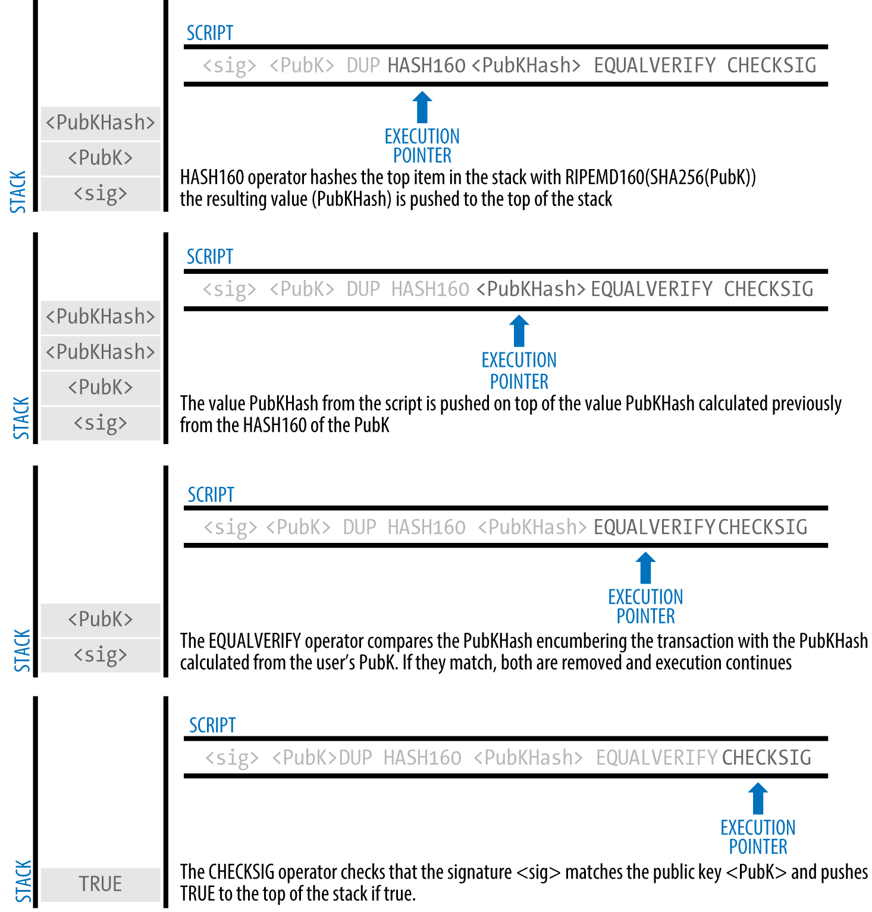

# explore1 tx

## tx

* https://www.blockchain.com/btc/tx/0627052b6f28912f2703066a912ea577f2ce4da4caa5a5fbd8a57286c345c2f2

```
bitcoin-cli getrawtransaction 0627052b6f28912f2703066a912ea577f2ce4da4caa5a5fbd8a57286c345c2f2
bitcoin-cli decoderawtransaction `bitcoin-cli getrawtransaction 0627052b6f28912f2703066a912ea577f2ce4da4caa5a5fbd8a57286c345c2f2`
```

## analyze


* (1)  
* (2)


```
node@bitcoin:~$ bitcoin-cli decoderawtransaction `bitcoin-cli getrawtransaction 0627052b6f28912f2703066a912ea577f2ce4da4caa5a5fbd8a57286c345c2f2`

{
  "txid": "0627052b6f28912f2703066a912ea577f2ce4da4caa5a5fbd8a57286c345c2f2",
  "hash": "0627052b6f28912f2703066a912ea577f2ce4da4caa5a5fbd8a57286c345c2f2",
  "version": 1,
  "size": 258,
  "vsize": 258,
  "weight": 1032,
  "locktime": 0,
  "vin": [
    {
      "txid": "7957a35fe64f80d234d76d83a2a8f1a0d8149a41d81de548f0a65a8a999f6f18",
      "vout": 0,
      "scriptSig": {
        "asm": "3045022100884d142d86652a3f47ba4746ec719bbfbd040a570b1deccbb6498c75c4ae24cb02204b9f039ff08df09cbe9f6addac960298cad530a863ea8f53982c09db8f6e3813[ALL] 0484ecc0d46f1918b30928fa0e4ed99f16a0fb4fde0735e7ade8416ab9fe423cc5412336376789d172787ec3457eee41c04f4938de5cc17b4a10fa336a8d752adf",
        "hex": "483045022100884d142d86652a3f47ba4746ec719bbfbd040a570b1deccbb6498c75c4ae24cb02204b9f039ff08df09cbe9f6addac960298cad530a863ea8f53982c09db8f6e381301410484ecc0d46f1918b30928fa0e4ed99f16a0fb4fde0735e7ade8416ab9fe423cc5412336376789d172787ec3457eee41c04f4938de5cc17b4a10fa336a8d752adf"
      },
      "sequence": 4294967295
    }
  ],
  "vout": [
    {
      "value": 0.01500000,
      "n": 0,
      "scriptPubKey": {
        "asm": "OP_DUP OP_HASH160 ab68025513c3dbd2f7b92a94e0581f5d50f654e7 OP_EQUALVERIFY OP_CHECKSIG",    //(3)
        "hex": "76a914ab68025513c3dbd2f7b92a94e0581f5d50f654e788ac",
        "address": "1GdK9UzpHBzqzX2A9JFP3Di4weBwqgmoQA",
        "type": "pubkeyhash"
      }
    },
    {
      "value": 0.08450000,
      "n": 1,
      "scriptPubKey": {
        "asm": "OP_DUP OP_HASH160 7f9b1a7fb68d60c536c2fd8aeaa53a8f3cc025a8 OP_EQUALVERIFY OP_CHECKSIG",
        "hex": "76a9147f9b1a7fb68d60c536c2fd8aeaa53a8f3cc025a888ac",
        "address": "1Cdid9KFAaatwczBwBttQcwXYCpvK8h7FK",
        "type": "pubkeyhash"
      }
    }
  ]
}


```

## lock unlock

*  (3) output sig script
* The Cafe Public Key Hash is equivalent to the Bitcoin address of the cafe, without the Base58Check encoding

```


OP_DUP OP_HASH160 <Cafe Public Key Hash>                  OP_EQUALVERIFY OP_CHECKSIG
OP_DUP OP_HASH160 ab68025513c3dbd2f7b92a94e0581f5d50f654e7 OP_EQUALVERIFY OP_CHECKSIG"


```

* The preceding locking script can be satisfied with an unlocking script of the form:

```
<Cafe Signature> <Cafe Public Key>

```
* The two scripts together would form the following combined validation script:

```
<Cafe Signature> <Cafe Public Key> OP_DUP OP_HASH160
<Cafe Public Key Hash> OP_EQUALVERIFY OP_CHECKSIG
```

* this combined script will evaluate to TRUE if, and only if, the unlocking script matches the conditions set by the locking scrip
* the result will be TRUE if the unlocking script has a valid signature from the cafe’s private key that corresponds to the public key hash set as an encumbrance.




## parent tx of income


```
bitcoin-cli decoderawtransaction `bitcoin-cli getrawtransaction 7957a35fe64f80d234d76d83a2a8f1a0d8149a41d81de548f0a65a8a999f6f18`

{
  "txid": "7957a35fe64f80d234d76d83a2a8f1a0d8149a41d81de548f0a65a8a999f6f18",
  "hash": "7957a35fe64f80d234d76d83a2a8f1a0d8149a41d81de548f0a65a8a999f6f18",
  "version": 1,
  "size": 225,
  "vsize": 225,
  "weight": 900,
  "locktime": 0,
  "vin": [
    {
      "txid": "713eef22615ffb7c2f8f813e79a0d1e170d05a99218e291c33daca258f284d52",
      "vout": 0,
      "scriptSig": {
        "asm": "3046022100a59e516883459706ac2e6ed6a97ef9788942d3c96a0108f2699fa48d9a5725d1022100f9bb4434943e87901c0c96b5f3af4e7ba7b83e12c69b1edbfe6965f933fcd17d[ALL] 04e5a0b4de6c09bd9d3f730ce56ff42657da3a7ec4798c0ace2459fb007236bc3249f70170509ed663da0300023a5de700998bfec49d4da4c66288a58374626c8d",
        "hex": "493046022100a59e516883459706ac2e6ed6a97ef9788942d3c96a0108f2699fa48d9a5725d1022100f9bb4434943e87901c0c96b5f3af4e7ba7b83e12c69b1edbfe6965f933fcd17d014104e5a0b4de6c09bd9d3f730ce56ff42657da3a7ec4798c0ace2459fb007236bc3249f70170509ed663da0300023a5de700998bfec49d4da4c66288a58374626c8d"
      },
      "sequence": 4294967295
    }
  ],
  "vout": [
    {
      "value": 0.10000000,
      "n": 0,
      "scriptPubKey": {
        "asm": "OP_DUP OP_HASH160 7f9b1a7fb68d60c536c2fd8aeaa53a8f3cc025a8 OP_EQUALVERIFY OP_CHECKSIG",
        "hex": "76a9147f9b1a7fb68d60c536c2fd8aeaa53a8f3cc025a888ac",
        "address": "1Cdid9KFAaatwczBwBttQcwXYCpvK8h7FK",
        "type": "pubkeyhash"
      }
    }
  ]
}


```
