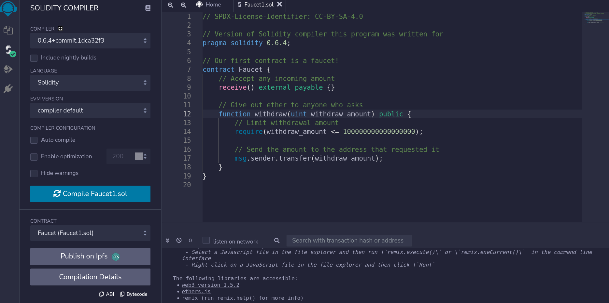

# compile

* online ide compile:




## abi


```
[
	{
		"inputs": [
			{
				"internalType": "uint256",
				"name": "withdraw_amount",
				"type": "uint256"
			}
		],
		"name": "withdraw",
		"outputs": [],
		"stateMutability": "nonpayable",
		"type": "function"
	},
	{
		"stateMutability": "payable",
		"type": "receive"
	}
]

```


## bycode

```
{
	"linkReferences": {},
	"object": "608060405234801561001057600080fd5b5060f48061001f6000396000f3fe608060405260043610601f5760003560e01c80632e1a7d4d14602a576025565b36602557005b600080fd5b348015603557600080fd5b50605f60048036036020811015604a57600080fd5b81019080803590602001909291905050506061565b005b67016345785d8a0000811115607557600080fd5b3373ffffffffffffffffffffffffffffffffffffffff166108fc829081150290604051600060405180830381858888f1935050505015801560ba573d6000803e3d6000fd5b505056fea264697066735822122037fd8881de1da9026d973f79b9ba79a352d91f04fd974a586ab1401e833aa5a264736f6c63430006040033",
	"opcodes": "PUSH1 0x80 PUSH1 0x40 MSTORE CALLVALUE DUP1 ISZERO PUSH2 0x10 JUMPI PUSH1 0x0 DUP1 REVERT JUMPDEST POP PUSH1 0xF4 DUP1 PUSH2 0x1F PUSH1 0x0 CODECOPY PUSH1 0x0 RETURN INVALID PUSH1 0x80 PUSH1 0x40 MSTORE PUSH1 0x4 CALLDATASIZE LT PUSH1 0x1F JUMPI PUSH1 0x0 CALLDATALOAD PUSH1 0xE0 SHR DUP1 PUSH4 0x2E1A7D4D EQ PUSH1 0x2A JUMPI PUSH1 0x25 JUMP JUMPDEST CALLDATASIZE PUSH1 0x25 JUMPI STOP JUMPDEST PUSH1 0x0 DUP1 REVERT JUMPDEST CALLVALUE DUP1 ISZERO PUSH1 0x35 JUMPI PUSH1 0x0 DUP1 REVERT JUMPDEST POP PUSH1 0x5F PUSH1 0x4 DUP1 CALLDATASIZE SUB PUSH1 0x20 DUP2 LT ISZERO PUSH1 0x4A JUMPI PUSH1 0x0 DUP1 REVERT JUMPDEST DUP2 ADD SWAP1 DUP1 DUP1 CALLDATALOAD SWAP1 PUSH1 0x20 ADD SWAP1 SWAP3 SWAP2 SWAP1 POP POP POP PUSH1 0x61 JUMP JUMPDEST STOP JUMPDEST PUSH8 0x16345785D8A0000 DUP2 GT ISZERO PUSH1 0x75 JUMPI PUSH1 0x0 DUP1 REVERT JUMPDEST CALLER PUSH20 0xFFFFFFFFFFFFFFFFFFFFFFFFFFFFFFFFFFFFFFFF AND PUSH2 0x8FC DUP3 SWAP1 DUP2 ISZERO MUL SWAP1 PUSH1 0x40 MLOAD PUSH1 0x0 PUSH1 0x40 MLOAD DUP1 DUP4 SUB DUP2 DUP6 DUP9 DUP9 CALL SWAP4 POP POP POP POP ISZERO DUP1 ISZERO PUSH1 0xBA JUMPI RETURNDATASIZE PUSH1 0x0 DUP1 RETURNDATACOPY RETURNDATASIZE PUSH1 0x0 REVERT JUMPDEST POP POP JUMP INVALID LOG2 PUSH5 0x6970667358 0x22 SLT KECCAK256 CALLDATACOPY REVERT DUP9 DUP2 0xDE SAR 0xA9 MUL PUSH14 0x973F79B9BA79A352D91F04FD974A PC PUSH11 0xB1401E833AA5A264736F6C PUSH4 0x43000604 STOP CALLER ",
	"sourceMap": "162:386:0:-:0;;;;5:9:-1;2:2;;;27:1;24;17:12;2:2;162:386:0;;;;;;;"
}

```


