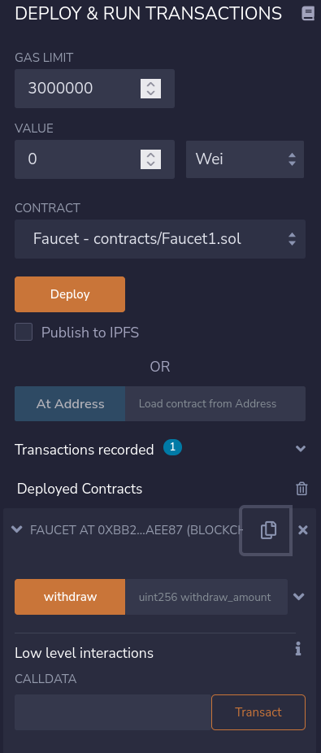

# register

* Registering a contract on the blockchain involves creating a special transaction whose destination is the address 0x0000000000000000000000000000000000000000, also known as the zero address


## deploy



```
address: 0xbB28Cd53b076132Bb1Fa266E0d88aA9Fd09AEE87
```


